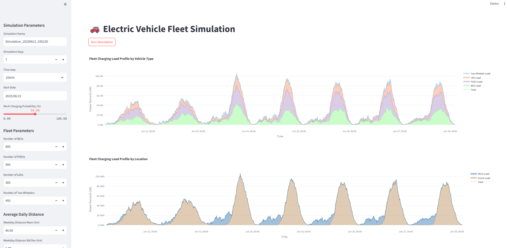
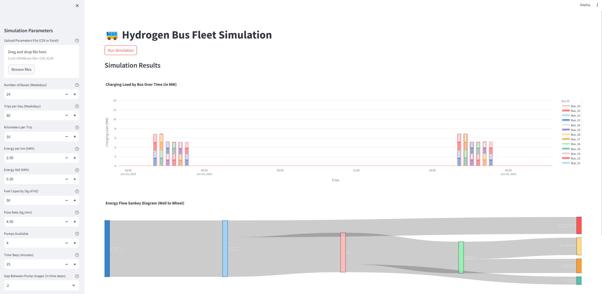

# Hyles Polynesia – Electric Vehicle Simulation Platform

This project simulates the deployment and performance of electric vehicles in a Polynesian island context. It includes modular tools for configuring different electric fleets, calculating performance metrics, and visualizing outcomes via a Streamlit dashboard.

The simulation focuses on two key subsystems:

- [**Cars**](./code/cars/) – Tools and logic for simulating personal electric vehicles.
- [**Bus**](./code/bus/) – Modules for evaluating public transport electrification, including route and charging models.

---

## 🚀 Features

- Streamlit-based GUI for easy interaction and parameter tweaking.
- Separate simulation logic for Cars and Bus systems.
- Support for real-world-like vehicle specs and route profiles.
- Customizable energy consumption, charging strategies, and solar production.
- Visual analytics.

---

## 🖼️ Streamlit GUI Preview

  

  

---

## 🔧 Getting Started

Each of the subrepos has it's own Readme. Head over to [**Cars**](./code/cars/README.md) or [**Bus**](./code/bus/README.md) to find out more on how to use the project.

---

## 🧐 Author

Developed by [mayze13](https://github.com/mayze13) – feel free to fork, contribute, or reach out.